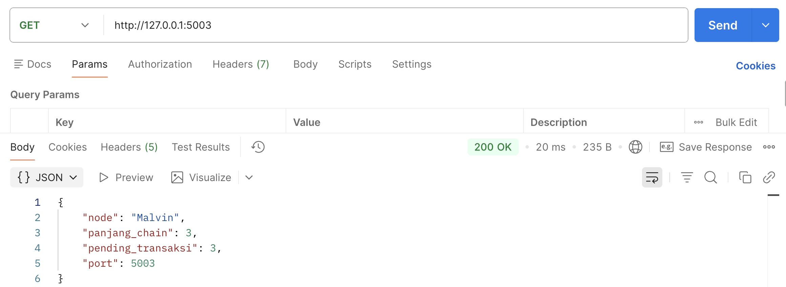
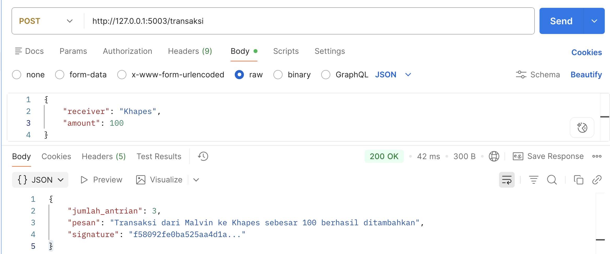
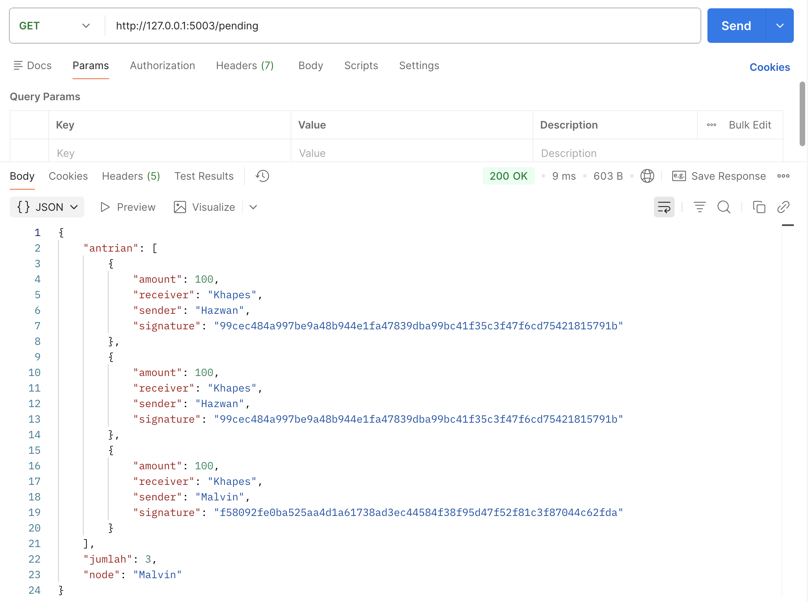
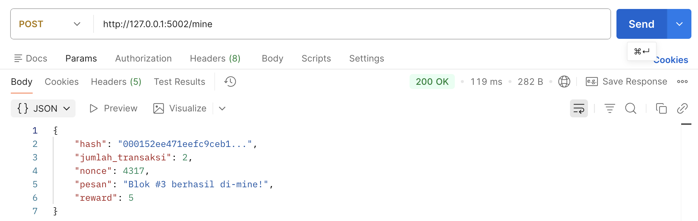
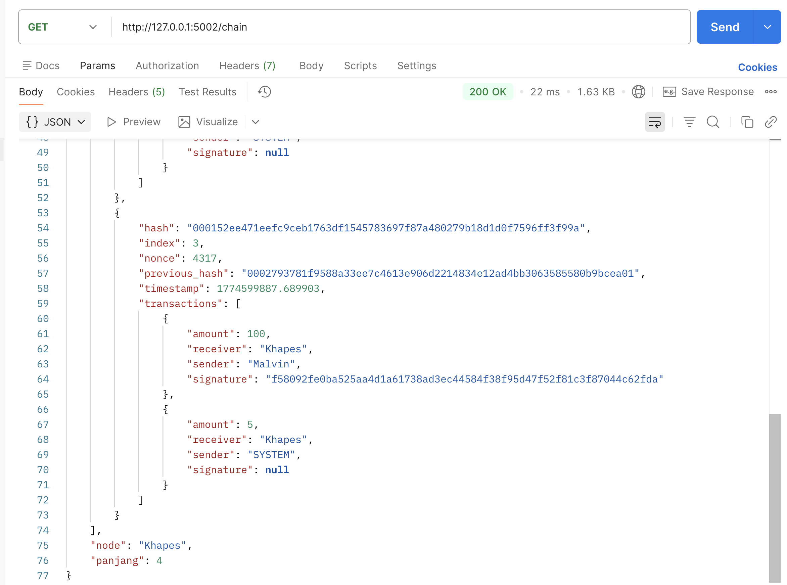

# Blockchain Fundamentals - Python Implementation

|Nama|NRP|
|---|---|
|Hazwan Adhikara Nasution|5027231017|
|Malvin Putra Rismahardian|5027231048|

A simple blockchain implementation with Flask REST API, digital signatures, Proof of Work mining, and multi-node synchronization.

<!-- **Group Members:** Hazwan, Khapes, Malvin (INI DIBUAT TABEL AJA NANTI + NRP) -->

---

## 📋 Features

✅ **Digital Signature** - SHA-256 based transaction signing  
✅ **Mining Reward** - 5 coins reward per mined block  
✅ **Multi-Node Network** - 3-4 nodes with automatic synchronization  
✅ **Proof of Work** - Mining with difficulty 3 (hash starts with "000")  
✅ **Flask REST API** - Complete API endpoints for blockchain operations  
✅ **Signature Validation** - Reject invalid/fake transactions

---

## 🏗️ Architecture

### Core Components

**`blockchain.py`** - Core blockchain logic

### 1. Sistem Keamanan & Digital Signature
Kode ini menggunakan `hashlib` untuk fungsi SHA-256. Setiap pengguna memiliki "kunci" unik yang tersimpan dalam `PRIVATE_KEYS`.

```python
def sign(self, private_key):
    self.signature = sha256(self._message() + private_key)

def is_valid(self):
    # ... pengecekan sender & receiver ...
    expected_signature = sha256(self._message() + PRIVATE_KEYS[self.sender])
    return expected_signature == self.signature
```
* **Penjelasan**: Fungsi `sign` membuat sidik jari digital unik untuk setiap transaksi. 
* **Keamanan**: Fungsi `is_valid` memastikan bahwa data transaksi (pengirim, penerima, jumlah) tidak diubah oleh siapa pun. Jika satu karakter saja berubah, hash yang dihasilkan tidak akan cocok dengan `signature`, dan transaksi akan ditolak.

---

### 2. Mekanisme Proof of Work (Mining)
Di dalam class `Block`, terdapat logika untuk "menambang" blok baru.

```python
def mine(self, difficulty):
    target = "0" * difficulty
    while not self.hash or not self.hash.startswith(target):
        self.nonce += 1
        self.hash = self.calculate_hash()
```
* **Penjelasan**: Penambang harus mencari nilai `nonce` yang tepat sehingga hash blok tersebut dimulai dengan sejumlah nol sesuai tingkat kesulitan (`difficulty`). 
* **Tujuan**: Ini mencegah serangan *spamming* atau perubahan data masal karena setiap penambahan blok membutuhkan tenaga komputasi nyata.

---

### 3. Struktur Rantai & Genesis Block
Class `Blockchain` mengatur urutan blok dan memberikan hadiah bagi penambang.

```python
def _genesis_block(self):
    genesis = Block(0, [], "0" * 16, nonce=0)
    genesis.hash = genesis.calculate_hash()
    return genesis

def mine_pending(self, miner_name):
    # ...
    reward_tx = Transaction("SYSTEM", miner_name, self.MINING_REWARD)
    self.pending_transactions.append(reward_tx)
    # ...
```
* **Genesis Block**: Blok nomor #0 yang menjadi pondasi awal seluruh rantai.
* **Mining Reward**: Setiap kali penambang berhasil membukukan transaksi ke dalam blok, sistem secara otomatis memberikan hadiah sebesar **5 koin** melalui transaksi spesial dari `SYSTEM`.

---

### 4. Konsensus (Replace Chain)
Fungsi ini adalah cara blockchain menjaga kesepakatan antar node di jaringan.

```python
def replace_chain(self, new_chain_data):
    if len(new_chain_data) <= len(self.chain):
        return False, "Chain baru tidak lebih panjang"
    # ... proses validasi chain baru ...
```
* **Penjelasan**: Mengikuti aturan **Longest Chain Rule**. Jika ada node lain yang memiliki rantai lebih panjang, node lokal akan memverifikasi seluruh integritas rantai tersebut (cek hash, cek link `previous_hash`, cek semua signature). Jika valid, node akan mengganti rantai lamanya dengan yang baru.

---


**`node.py`** - Flask REST API server

### 1. Manajemen Jaringan & Peers
Kode ini secara eksplisit mendefinisikan daftar node yang ada dalam jaringan.

```python
ALL_NODES = {
    "Hazwan": "http://127.0.0.1:5001",
    "Khapes": "http://127.0.0.1:5002",
    "Malvin": "http://127.0.0.1:5003",
    "Messi": "http://127.0.0.1:5004",
}
PEERS = {name: url for name, url in ALL_NODES.items() if name != NODE_NAME}
```
* **Penjelasan**: Setiap node mengenali tetangganya (*peers*) melalui alamat IP dan port. 
* **Fungsi**: Variabel `PEERS` menyaring daftar agar node tidak mengirim pesan ke dirinya sendiri, memastikan komunikasi hanya terjadi ke node luar.

---

### 2. Mekanisme Broadcast (Penyebaran Data)
Agar seluruh jaringan memiliki data yang sama, node harus menyebarkan informasi setiap kali ada perubahan.

```python
def broadcast(endpoint, payload):
    for name, url in PEERS.items():
        try:
            requests.post(url + endpoint, json=payload, timeout=3)
```
* **Alur Kerja**: Saat kamu membuat transaksi atau menambang blok di satu node, fungsi `broadcast` akan mengirimkan data tersebut ke semua node lain secara otomatis.
* **Keandalan**: Terdapat blok `try-except` untuk memastikan jika satu node mati, node lainnya tetap bisa menerima data tanpa menghentikan sistem.

---

### 3. Sinkronisasi & Konsensus Jaringan
Ini adalah bagian paling krusial untuk menjaga integritas data antar node.

```python
def sinkronisasi():
    for name, url in PEERS.items():
        response = requests.get(url + "/chain", timeout=3)
        data = response.json()
        ok, msg = bc.replace_chain(data["chain"])
```
* **Longest Chain Rule**: Fungsi `sinkronisasi` secara aktif meminta data dari node lain dan membandingkannya. 
* **Fungsi**: Jika node lain memiliki rantai yang lebih panjang dan valid (setelah diverifikasi oleh `blockchain.py`), node lokal akan mengganti datanya agar sama dengan mayoritas jaringan.

---

### 4. REST API Endpoints
Node menyediakan beberapa pintu (endpoints) agar kita bisa berinteraksi menggunakan Postman atau Browser:

* **`POST /transaksi`**: Membuat transaksi baru, menandatanganinya secara digital, dan menyebarkannya ke jaringan.
* **`POST /mine`**: Memulai proses Proof of Work untuk membungkus transaksi menjadi blok dan menyebarkan blok baru tersebut.
* **`GET /chain`**: Melihat seluruh isi blockchain yang tersimpan di node tersebut.
* **`GET /pending`**: Melihat daftar transaksi yang sedang mengantri untuk ditambang.

---


---

## 📦 Project Structure

```
blockchain-fundamentals/
├── blockchain.py       # Core blockchain implementation
├── node.py            # Flask API server
├── requirements.txt   # Python dependencies
├── img/              # Testing screenshots
└── README.md         # This file
```

---

## 🚀 How to run?

### 1. Install Dependencies

```bash
pip3 install -r requirements.txt
```

### 2. Run Multiple Nodes

Open 3-4 separate terminals:

**Terminal 1:**

```bash
python3 node.py Hazwan 5001
```

**Terminal 2:**

```bash
python3 node.py Khapes 5002
```

**Terminal 3:**

```bash
python3 node.py Malvin 5003
```

**Terminal 4 (optional):**

```bash
python3 node.py Messi 5004
```

---

## 📡 API Endpoints

| Method | Endpoint             | Description                   |
| ------ | -------------------- | ----------------------------- |
| `GET`  | `/`                  | Node status                   |
| `POST` | `/transaksi`         | Create transaction            |
| `GET`  | `/pending`           | View pending transactions     |
| `POST` | `/mine`              | Mine new block                |
| `GET`  | `/chain`             | View entire blockchain        |
| `POST` | `/transaksi/terima`  | Receive broadcast transaction |
| `POST` | `/chain/terima-blok` | Receive block notification    |

---

## 🧪 Testing with Postman

### 1. Node Status Check

```
GET http://127.0.0.1:5001/
```



### 2. Create Transaction

```
POST http://127.0.0.1:5001/transaksi
Body (JSON):
{
  "receiver": "Khapes",
  "amount": 10
}
```



### 3. View Pending Transactions

```
GET http://127.0.0.1:5001/pending
```



### 4. Mine Block

```
POST http://127.0.0.1:5001/mine
```



### 5. View Blockchain

```
GET http://127.0.0.1:5001/chain
```



---

## 🔐 Security Features

1. **Digital Signature Validation**
   - Every transaction signed with SHA-256(message + private_key)
   - Invalid signatures rejected automatically

2. **Proof of Work**
   - Mining difficulty: 3 (hash must start with "000")
   - Prevents spam and secures the network

3. **Chain Validation**
   - Verify hash integrity of each block
   - Check previous_hash linkage
   - Validate all transaction signatures

4. **Consensus Mechanism**
   - Longest chain rule
   - Automatic synchronization across nodes

---

## 📝 Assignment Requirements Checklist

✅ Digital signature implementation  
✅ Mining reward system  
✅ Minimum 3 nodes setup  
✅ Flask API + Postman testing  
✅ Source code documentation  
✅ Markdown documentation  
✅ Screenshot evidence:

- Transaction creation
- Mining process
- Miner rewards
- Digital signature validation
- Node synchronization

---

## 🛠️ Tech Stack

- **Python 3.x** - Core language
- **Flask 3.0.0** - REST API framework
- **hashlib** - SHA-256 hashing (built-in)
- **requests** - HTTP communication between nodes

---
